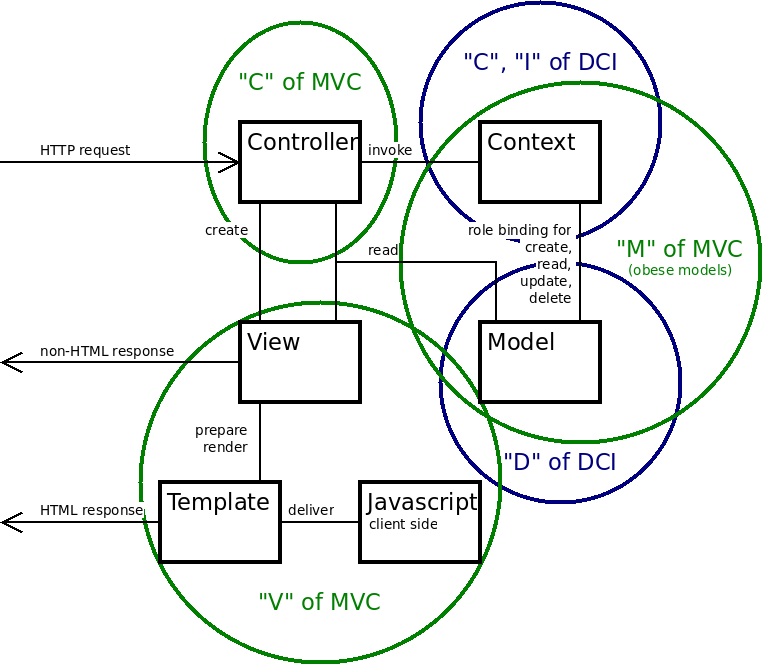

# Vicocomo - MVC-DCI plugin for the Fat-Free Framework

W.I.P

This is a simple framework for the Model-View-Controller and
Data-Context-Interaction patterns, built on top of the Fat-Free Framework (F3)
for PHP web applications.

## Concerns

The name is short for View, Controller, Context, Model.  The idea is that
separation of concerns.  Code for the Controller, Context, and Model concerns
should be kept in the `controllers`, `contexts`, and `models` directories.
Code for the View concern is split between the server and the browser.  Given
that you probably want to use the Fat-Free Famwork Template engine on the
server and javascript in the browser, the View software should be kept in the
directories `javascripts`, `templates`, and `views`.

The figure hopefully clarifies how this relates to MVC and DCI.  Note that the
"View" here is a subset of the "V" of MVC.  In the following, "view" always
refers to the narrower concern.  As indicated, we recommend channeling *all*
user requests through a `Controller`, including requests for a specific *look*
rather than a specific *content*.

 

 
 

## The framework software

Under the `lib`directory in the distribution you will find a number of PHP
source files.  They are supposed to enhance your productivity and make your
software easier to understand.

All files define PHP `class`es, `interface`s, and `trait`s in the namespace
`Vccm`.  They have names that work with the F3 autoloader if you put them in
a directory `vccm` under an autoload root, i.e. the F3 `Base` class
directory or one defined in the F3 hive variable `AUTOLOAD`.

The trait `Vccm\GeneralUtils` contains some functions that I find generally
useful.  They are by no means essential for the framework.

The class `Vccm\Base` *is* essential.  It is a singleton mainly containing
initialization functions.

The rest of the framework classes, interfaces, and traits are more concern
specific.  All are in the namespace `Vccm`.  A short introduction to how they
may be useful for each of the concerns follows below, omitting the namespace
`Vccm` for brevity.

## View

#### Javascript code in the `javascript` directory

No help provided here, except  a little in `Vccm\View` to help choosing and
serving the apporpriate Javascript code.

#### F3 template code in the `templates` directory

F3 templates, typically reading data written to the F3 Hive by PHP code in a
view.

#### PHP code in the `view` directory

There is a trait `View` that contains some functions that may be useful
regardless of what the view is about.  Your views are expected to use this
trait.  The reason for having a trait rather than a class is to enable you to
have your own class hierarchy for your UI.

The view may take parameters from the Controller to specify what should be
viewed and how it should look.

The trait implements a a tree structure for views ("include" in the figure
above).  A view that manages an HTML response and is the root of a view
include tree must prepare and render an F3 template.

A view that is involved in an HTML response and is not the root of a view
include tree may prepare a template but not render it.  The templates should
have an F3 &lt;include&gt; structure that mirrors the view tree.

## Controller

## Model

There is no framework code for general models.

The trait `SqlModel` makes your model class behave like an F3 `DB\SQL\Mapper`.
In addition, `SqlModel` gives you methods for one-to-many and many-to-many
associations, text columns storing markdown, JSON, or objects, and object
comparison.

For this to work, each *class* (as opposed to instance) using `SqlModel` must
be connected to a factory that is an instance of the class `SqlModelFactory`.
The connection is done by the method `createSqlModelFactories()` in the `Base`
singleton.

For storing object-valued fields, the object in question must be of a class
that implements the `ObjectAttr` interface.

